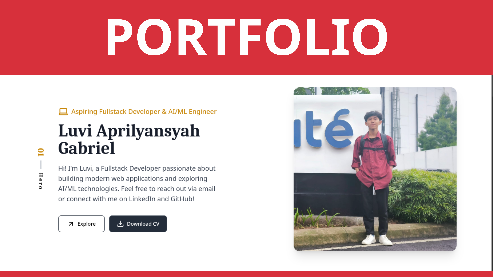
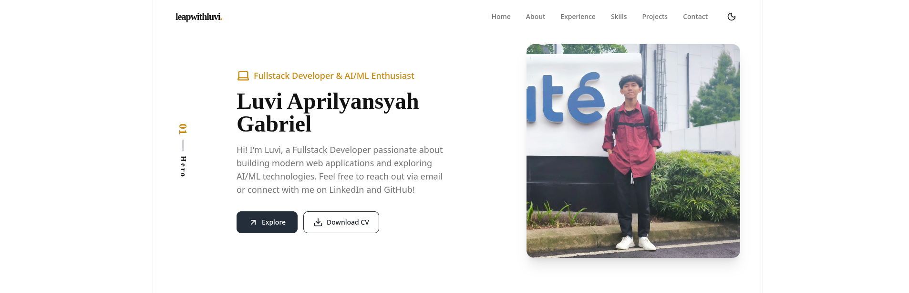
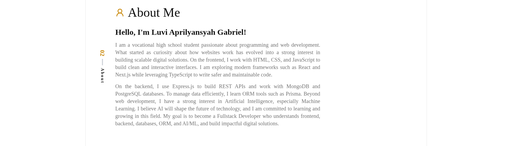
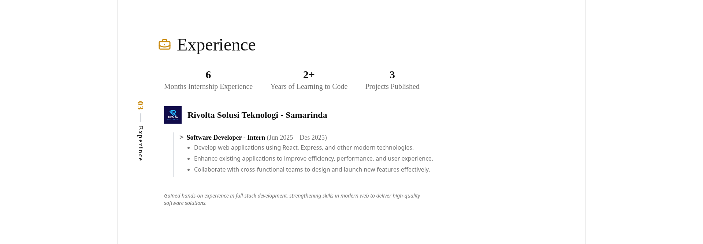
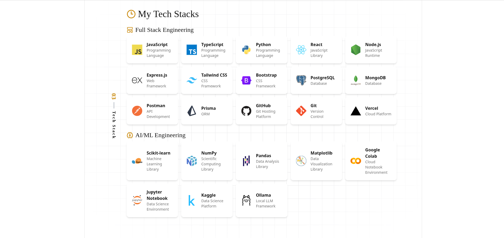
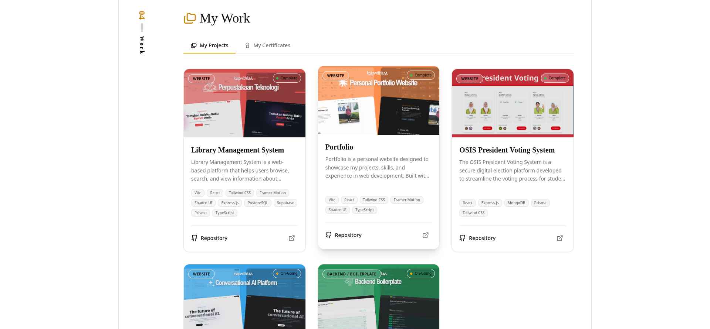
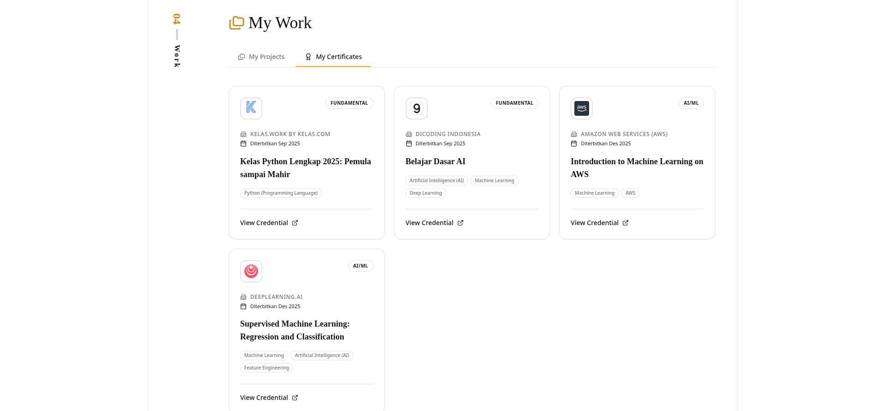

# 🌟 Luvi Aprilyansyah Gabriel — Personal Portfolio

<!-- GitHub badges -->
[](https://github.com/leapwithluvi/portfolio/stargazers)
[](https://github.com/leapwithluvi/portfolio/forks)
[](https://github.com/leapwithluvi/portfolio/commits)
[](https://github.com/leapwithluvi/portfolio/pulls)



[](https://github.com/leapwithluvi)
[](https://github.com/leapwithluvi/portfolio/blob/main/LICENSE)
[](https://www.typescriptlang.org/)


## 🖥️ Live Preview

👉 **[Visit My Portfolio → luvi.my.id](https://luvi.my.id)**

<details><summary>Screenshot</summary>









</details>

## 📖 Table of Contents

<details><summary>Table of Contents</summary>

- [Description](#-description)
- [Key Features](#-key-features)
- [Folder Structure](#-folder-structure)
- [Technologies Used](#-technologies-used)
- [Contact](#-contact)
- [License](#-license)

</details>

## 📝 Description

**Luvi Aprilyansyah Gabriel — Personal Portfolio** is a premium, modern, and responsive personal portfolio website built with **React**, **TypeScript**, **Vite**, **Tailwind CSS**, and **Framer Motion**. It serves as a comprehensive showcase of my skills, projects, experience, and contact information as a **Fullstack Developer & AI/ML Enthusiast**.

Designed with a focus on aesthetics and user experience, this portfolio features smooth animations, a clean interface, and a professional layout to highlight my technical journey and capabilities.

## ✨ Key Features

- **🎨 Premium Design**: Modern, clean, and professional aesthetic with attention to detail.
- **🌀 Smooth Scrolling**: Fluid navigation powered by **Lenis** smooth scroll.
- **💫 Dynamic Animations**: Engaging section transitions and micro-interactions using **Framer Motion**.
- **📱 Fully Responsive**: Seamlessly optimized for all devices, from mobile to desktop.
- **📂 Project Showcase**: Interactive display of featured projects with direct GitHub links.
- **🛠️ Tech Stack Visualization**: Clear representation of expertise in both Fullstack and AI/ML Engineering.
- **📬 Direct Contact**: Integrated contact section with social media links for easy networking.

## 📂 Folder Structure

<details><summary><b>Project Layout</b></summary>

```bash
src/
├── assets/               # Images and static assets (Project screenshots, etc.)
├── components/           # Reusable UI components
│   ├── ui/               # Base UI elements (grid patterns, etc.)
│   ├── CardProject.tsx   # Project showcase cards
│   ├── CardSkills.tsx    # Skills visualization components
│   └── ...               # Navbar, Footer, and other layout components
├── pages/                # Main section pages
│   ├── HeroPages.tsx     # Landing hero section
│   ├── AboutPages.tsx    # Personal bio and developer journey
│   ├── ProjectPages.tsx  # Interactive project gallery
│   └── ...               # Experience, Skills, and Contact sections
├── utils/                # Data constants and static content
│   ├── DataProjects.tsx  # Projects database
│   ├── DataSkillsWeb.tsx # Web development skills data
│   └── ...
├── types/                # Shared TypeScript interfaces
├── lib/                  # Utility helpers and configurations
└── App.tsx               # Main application entry and layout
```

</details>

## ✨ Technologies Used

<details><summary>This project is built using a modern high-performance stack:</summary>

- [React](https://react.dev/): A JavaScript library for building user interfaces.
- [TypeScript](https://www.typescriptlang.org/): A typed superset of JavaScript for error-free development.
- [Vite](https://vitejs.dev/): Next-generation frontend tooling for fast builds.
- [Tailwind CSS](https://tailwindcss.com/): A utility-first CSS framework for rapid UI development.
- [Framer Motion](https://www.framer.com/motion/): A production-ready motion library for React.
- [Lenis Scroll](https://github.com/darkroomengineering/lenis): Implementation of high-performance smooth scrolling.
- [Lucide React](https://lucide.dev/): Beautifully simple, pixel-perfect icons.
- [Shadcn UI](https://ui.shadcn.com/): Reusable components built using Radix UI and Tailwind CSS.

</details><br/>

[](https://skillicons.dev)

## 🚀 Featured Projects

- 🔗 [Library Management System](https://github.com/leapwithluvi/library-management-system)
- 🔗 [Conversational AI Platform](https://github.com/leapwithluvi/ai-chatbot)
- 🔗 [Express TypeScript Starter (Backend Boilerplate)](https://github.com/leapwithluvi/express-typescript-starter)

---

## 📬 Contact

| Platform | Link |
|----------|------|
| 📧 Email | [itsluvi13@gmail.com](mailto:itsluvi13@gmail.com) |
| 💼 LinkedIn | [luviaprilyansyahgabriel](https://www.linkedin.com/in/luviaprilyansyahgabriel) |
| 🐙 GitHub | [leapwithluvi](https://github.com/leapwithluvi) |
| 📸 Instagram | [@byl.rooks](https://www.instagram.com/byl.rooks) |

---

## 📜 Credits & Inspiration

This portfolio was inspired by the design of **[Delfan Rynaldo Laden](https://www.delfanladen.my.id/)**. Huge thanks for the inspiration!


## 📋 License

This project is licensed under the **MIT License**. See the [LICENSE](LICENSE) file for more details.

---

## 🚀 Let's Connect

I'm open to collaboration, freelance, and junior developer opportunities.

If you're looking for a passionate Fullstack Developer, let's build something impactful together.

---

> Built by **Luvi Aprilyansyah Gabriel** — Fullstack Developer & AI/ML Enthusiast